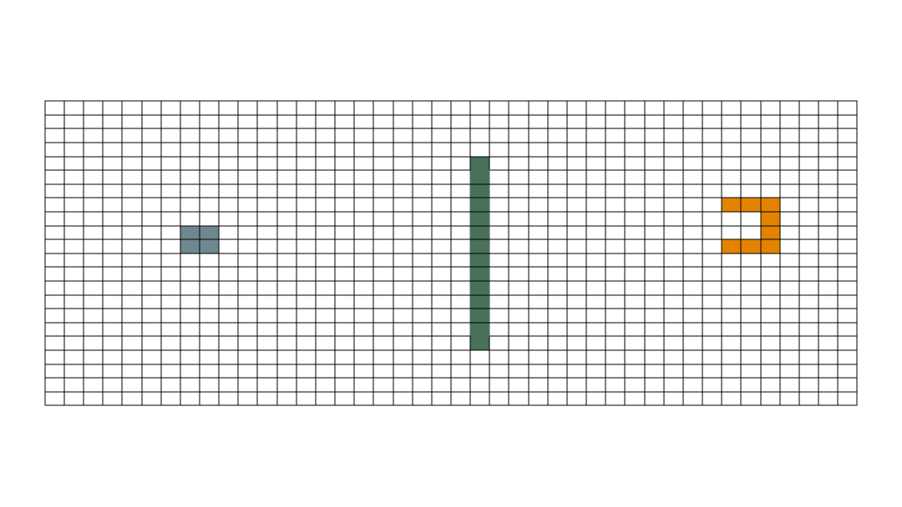

# Front-End Engineering Interview Project
**NOTE:** this was converted from original PDF using DeepSeek

## Visual reference

## Problem Statement
You are given an engineering problem to be completed within **48 hours** from receipt of the email, with an expected effort of **4-6 hours** of actual coding/design/deployment. The task involves creating a simple browser-based game using React/Next/Vue, with basic integration to a multimodal LLM like OpenAI or Gemini.

### Game Requirements
- **Grid Layout**:  
  - Minimum of 64x64 squares.  
  - Grid dimensions adjust based on browser window aspect ratio but remain fixed once the game starts.  

- **Game Elements**:  
  1. **Ball**: A 2x2 square.  
  2. **Wall**: A single-square-width barrier bisecting the page horizontally or vertically, with a 4-square gap on either side (e.g., `Browser Width - 8 blocks` or `Browser Height - 8 blocks`).  
  3. **Glove**: A C-shaped structure placed opposite the ball, across the wall. It can face any direction (up, down, left, or right).  

- **Objective**: Move the ball into the glove's opening using voice commands.  

### Voice Control Specifications
1. **Commands**: Natural language (e.g., "Move 2 up," "Go 5 left").  
2. **Listening Mode**:  
   - Preferred: Automatic pause detection with always-on listening.  
   - Fallback: Button to start/stop recording, sending voice input to an LLM.  
3. **Integration**: Realtime WebSocket (e.g., OpenAI/Gemini APIs) is preferred.  

### Deliverables
- **GitHub Repo**: Include instructions for setup and testing.  
- **Infrastructure**: Ensure server-side components (AWS/Azure/OpenAI) remain available for at least one week post-completion.  

### Guidelines
- Open-source tools/code are allowed with attribution. Avoid blind copy-pasting.  
- AI-assisted coding is acceptable, but maintain consistent style and elegance.  
- A 30-minute follow-up call will review the code/demo.  

### Evaluation Rubric
1. System Design  
2. Code Flow/Style/Design  
3. UI Performance and Smoothness  
4. Product Thinking  
5. Code Completeness & Quality  